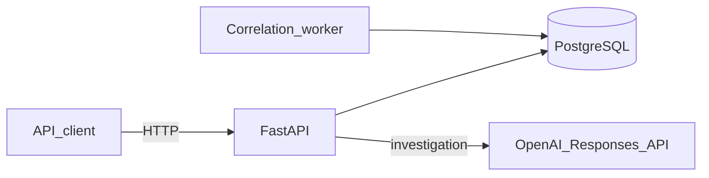
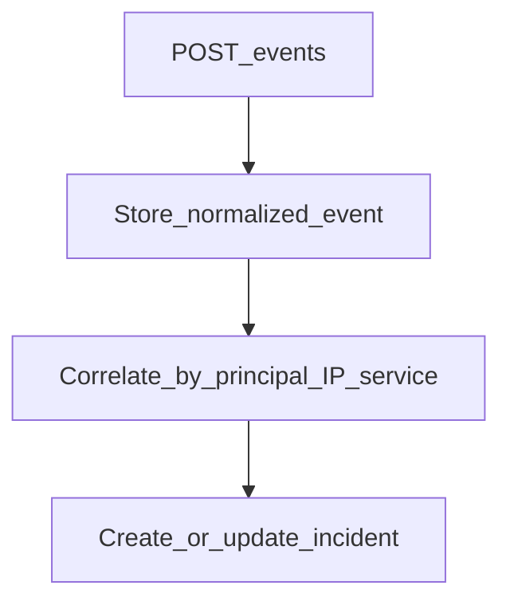
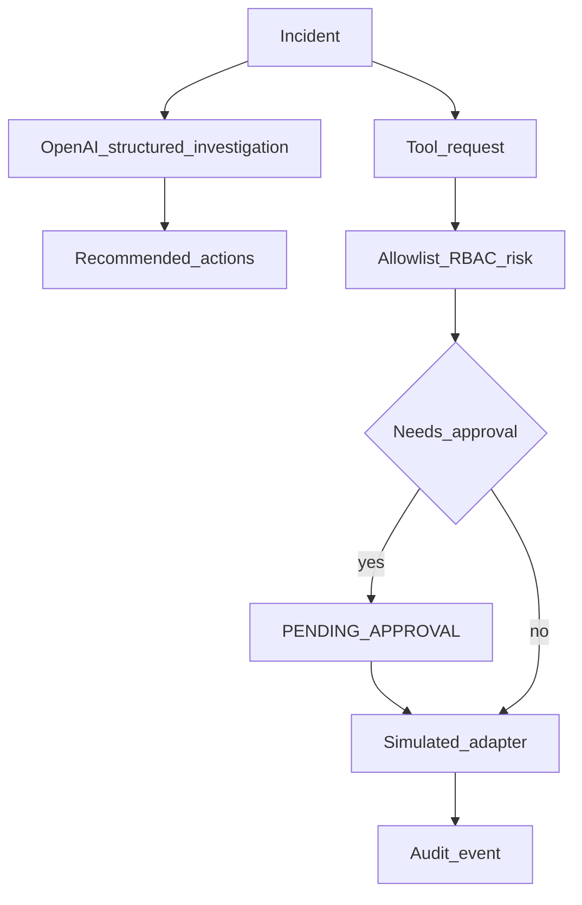

# SecureOps

Security event ingestion, correlation, and policy-gated response tools. FastAPI + PostgreSQL. The investigator can recommend actions; only the tool gateway can run them.

## System



## Event to incident



Correlation runs via `POST /correlate` or `workers/correlation_worker.py`.

## Investigation and tools



## API

| Method | Path | Notes |
|--------|------|-------|
| GET | `/health` | |
| POST | `/events` | Ingest |
| POST | `/correlate` | Group open events |
| GET | `/incidents` | List |
| GET | `/incidents/{id}` | Detail |
| POST | `/incidents/{id}/assign` | |
| POST | `/incidents/{id}/close` | |
| POST | `/incidents/{id}/ai-investigation` | LLM summary (advisory) |
| GET | `/incidents/{id}/audit` | Audit trail |
| POST | `/incidents/{id}/tools` | Request a tool |
| POST | `/tool-requests/{id}/approval` | Approve high-risk |

Tools: `get_auth_activity`, `get_service_health` (low); `revoke_session` (high); `isolate_service` (critical, admin). Adapters return simulated results.

## LLM investigation

`POST /incidents/{id}/ai-investigation` calls the OpenAI Responses API and validates output with a Pydantic schema (summary, observations, hypotheses, cited event IDs, recommended actions). The model cannot run SecureOps tools; execution stays behind policy, RBAC, and approval.

Set `LLM_API_KEY` in `.env` (see `.env.example`). Default model is `gpt-5.6-luna` via `LLM_MODEL`. Do not commit the key.

```bash
cp .env.example .env
curl -X POST http://localhost:8200/incidents/1/ai-investigation \
  -H "Authorization: Bearer analyst-token" \
  -H "Content-Type: application/json" \
  -d '{"prompt":"Explain the strongest evidence and recommended next steps."}'
```

## Run

Needs Python 3.12.

```
docker compose up -d db
python -m venv .venv
pip install -r requirements.txt
python scripts/init_db.py
python scripts/seed_demo.py
uvicorn apps.api.main:app --reload --port 8200
```

Worker:

```
python workers/correlation_worker.py
```

API docs: http://localhost:8200/docs

Evals:

```
PYTHONPATH=. python evals/run_security_eval.py
```

## Auth (local)

| Token | Role |
|-------|------|
| `Bearer analyst-token` | analyst |
| `Bearer responder-token` | responder |
| `Bearer admin-token` | admin |
