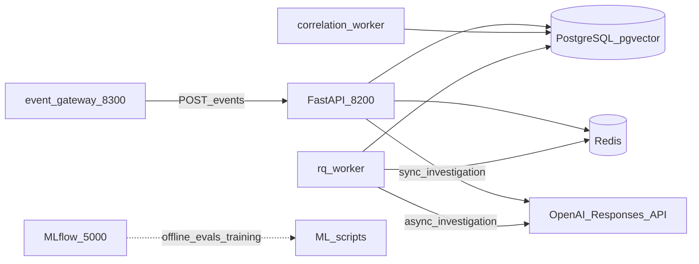
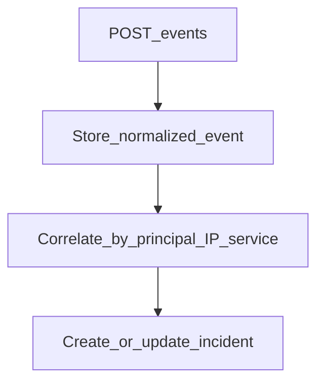
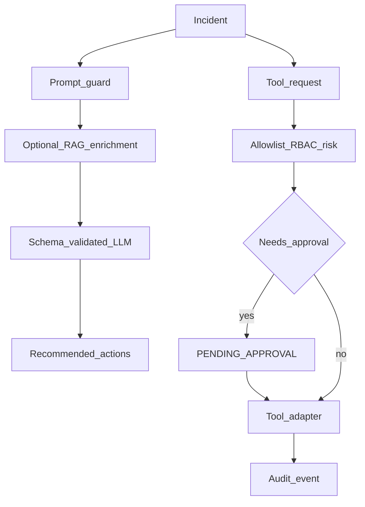

# SecureOps

Security event ingestion, correlation, and policy-gated response tools. FastAPI + PostgreSQL + Redis. LLM investigation is advisory; tools run only through the gateway.

## System



## Event to incident



Correlation runs in `correlation-worker` or via `POST /correlate`.

## Investigation and tools



Async investigation: `POST /incidents/{id}/ai-investigation/async` → Redis/RQ → `GET /jobs/{job_id}`.

## API

| Method | Path |
|--------|------|
| GET | `/health` |
| GET | `/metrics` |
| POST | `/events` |
| POST | `/correlate` |
| GET | `/incidents` |
| GET | `/incidents/{id}` |
| POST | `/incidents/{id}/assign` |
| POST | `/incidents/{id}/close` |
| GET | `/incidents/{id}/audit` |
| POST | `/incidents/{id}/ai-investigation` |
| POST | `/incidents/{id}/ai-investigation/async` |
| GET | `/jobs/{job_id}` |
| POST | `/incidents/{id}/tools` |
| POST | `/tool-requests/{id}/approval` |

Gateway: `http://localhost:8300` (`POST /events`).

Tools: `get_auth_activity`, `get_service_health` (HTTP when `SERVICE_HEALTH_BASE_URL` is set); `revoke_session` (high); `isolate_service` (critical, admin).

## Run

```bash
cp .env.example .env
# set LLM_API_KEY
docker compose up --build -d
docker compose exec api python scripts/init_db.py
docker compose exec api python scripts/seed_demo.py
```

Optional RAG index (needs RAG image / `requirements-rag.txt`):

```bash
docker compose exec api python scripts/index_knowledge.py
```

| URL | Service |
|-----|---------|
| http://localhost:8200/docs | API |
| http://localhost:8200/metrics | Prometheus scrape |
| http://localhost:8300 | Event gateway |
| http://localhost:5000 | MLflow UI |

### Auth

`AUTH_MODE=demo` (default): `analyst-token`, `responder-token`, `admin-token`.

JWT:

```bash
# .env: AUTH_MODE=jwt
python scripts/mint_dev_jwt.py --role analyst
```

OIDC: `AUTH_MODE=oidc` plus `OIDC_JWKS_URL`, `JWT_ISSUER`, `JWT_AUDIENCE`.

### Images / deps

| File | Purpose |
|------|---------|
| `requirements-api.txt` / `Dockerfile` | API + workers |
| `requirements-rag.txt` / `Dockerfile.rag` | Embeddings / RAG |
| `requirements-ml.txt` | LoRA / PEFT |
| `requirements-ci.txt` | CI |

## ML extras

```bash
python -m src.ml.train_classifier
pip install -r requirements-ml.txt && python -m src.ml.train_lora --mode lora
# CUDA QLoRA: pip install -r requirements-ml-gpu.txt && python -m src.ml.train_lora --mode qlora
python -m src.evaluation.mlflow_eval
```

## MCP

```bash
python -m src.mcp_server.server
```

Exposes incident context, knowledge search, and policy preview. No privileged execution.
